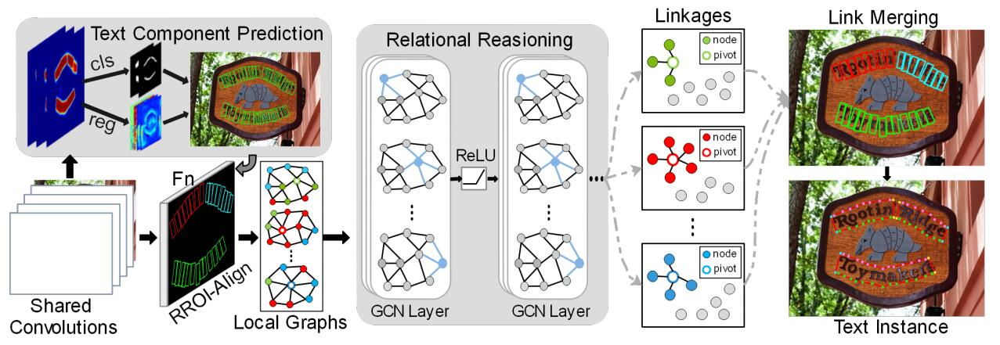

# 论文名称
[**Deep Relational Reasoning Graph Network for Arbitrary Shape Text Detection**](https://arxiv.org/abs/2003.07493)

Shi-Xue Zhang, Xiaobin Zhu, Jie-Bo Hou, Chang Liu, Chun Yang, Hongfa Wang, Xu-Cheng Yin
## 目录

```
1. 简介
2. 数据集和复现精度
3. 其他实验
4. 开始使用
```


## 1. 简介




* 文章中提出了一种关系推理图网络解决任意形状的文本检测问题。将每一个文本实例，看做多个文本组件的组合，使用基于CNN的文本提取模型估计这些文本组件的几何属性（高、宽、方向）；在此基础上，局部图模型大致估计出不同文本组件的链接关系；然后通过GCN进一步推断文本组件与其相邻组件之间的链接可能性；最后根据推理结果将文本组件聚合为整体的文本实例。

* 感谢[DRRG](https://github.com/GXYM/DRRG)、[MMOCR](https://github.com/open-mmlab/mmocr/blob/main/configs/textdet/drrg/README.md)和[MMCV](https://github.com/open-mmlab/mmcv)开源的PyTorch代码，感谢[PaddleOCR](https://github.com/PaddlePaddle/PaddleOCR)，提高了复现论文的效率。


* 本项目已经上传[AI Studio](https://aistudio.baidu.com/aistudio/clusterprojectdetail/4584040)， 可以直接训练测试。
* 本项目中用到的[RoIAlignRotated](https://github.com/zhiminzhang0830/RoIAlignRotated_Paddle)算子，已经单独做了开源，可直接下载使用。

## 2. 数据集和复现精度

* 数据集：[CTW1500](https://github.com/Yuliang-Liu/Curve-Text-Detector)

* 数据集大小：
    * 训练集：1000
    * 验证集：500

* 数据集目录结构：
  ```
    ctw1500/
      └─ imgs/         
          └─ training/             
          └─ test/    
          └─ training.txt
          └─ test.txt 
  ```
* 数据集可以从[此处下载](https://aistudio.baidu.com/aistudio/datasetdetail/120898)

* **复现精度**

  |Backbone|Dataset|Pretrained|Epochs|Hmean|Config
  |:-----:|:-----:|:-----:|:-----:|:-----|:-----:
  |R50|ctw1500|ImageNet(PyTorch)|1200|0.8411|[det_r50_drrg_ctw_torch](configs/det/det_r50_drrg_ctw_torch.yml)

  **预训练模型使用的是PyTorch版本的ResNet50，转换的预训练模型及训练结果权重从[此处下载](https://pan.baidu.com/s/1xPnrK0NLSyuWDEVuB8YK1Q?pwd=1ccl)

## 3. 其他实验
 - 上一节中完成了基于PyTorch预训练模型的复现，本节中基于PaddleOCR中提供的预训练模型   [ResNet18_vd](https://github.com/PaddlePaddle/PaddleOCR/blob/release/2.6/doc/doc_en/detection_en.md) 和 [ResNet50_vd](https://github.com/PaddlePaddle/PaddleOCR/blob/release/2.6/doc/doc_en/detection_en.md) 进行了实验，方便与其他算法进行对比。
 - 预训练模型下载：

        # download the pre-trained model of ResNet18_vd
        wget -P ./pretrain_models/ https://paddleocr.bj.bcebos.com/pretrained/ResNet18_vd_pretrained.pdparams
        # download the pre-trained model of ResNet50_vd
        wget -P ./pretrain_models/ https://paddleocr.bj.bcebos.com/pretrained/ResNet50_vd_ssld_pretrained.pdparams

- **实验结果**
  |Backbone|Dataset|Pretrained|Epochs|Hmean|Config
  |:-----:|:-----:|:-----:|:-----:|:-----|:-----:
  |R18_vd|ctw1500|ImageNet|1200|0.8453|[det_r18_drrg_ctw](configs/det/det_r18_drrg_ctw.yml)
  |R50_vd|ctw1500|ImageNet|1200|0.8478|[det_r50_drrg_ctw](configs/det/det_r50_drrg_ctw.yml)
  |R50_vd_dcn|ctw1500|ImageNet|1200|0.8580|[det_r50_dcn_drrg_ctw](configs/det/det_r50_dcn_drrg_ctw.yml)

  **训练结果权重从[此处下载](https://pan.baidu.com/s/1Obb3yR3sOiQPquLDROdWAQ?pwd=238v)


## 4. 开始使用

### 4.1 准备环境

- 框架：
  - PaddlePaddle==2.3.1

- 克隆本项目：

      git clone https://github.com/zhiminzhang0830/DRRG_Paddle.git
      cd DRRG_Paddle

- 安装第三方库：

      pip install -r requirements.txt


### 4.2 快速开始

  * **设置数据集路径:**

        #修改文件configs/det/det_r50_drrg_ctw.yml中的data_dir和label_file_list字段
        Train:
            dataset:
                data_dir: your train data dir
                label_file_list: 
                - your train label file

        Eval:
            dataset:
                data_dir: your eval data dir
                label_file_list: 
                - your eval label file

  * **模型训练:**

        # 训练前需要下载预训练模型至pretrain_models文件夹，修改配置文件中预训练模型的路径
        python3 -m paddle.distributed.launch --log_dir=./debug/ --gpus '0,1,2,3'  tools/train.py -c configs/det/det_r50_drrg_ctw.yml \
            -o Train.loader.batch_size_per_card=4 \
            Global.save_model_dir=./output/det_r50_drrg_ctw/ 
    

  * **模型验证:**

        cfg_file=./output/det_r50_drrg_ctw/config.yml
        model_file=./output/det_r50_drrg_ctw/best_accuracy.pdparams
        python3 tools/eval.py -c $cfg_file \
                            -o Global.pretrained_model=$model_file

 


